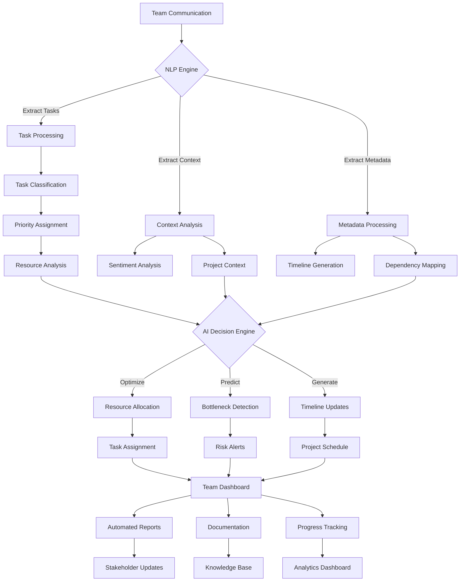
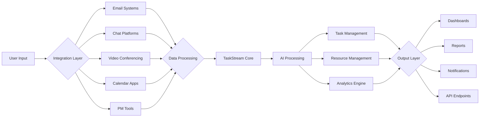
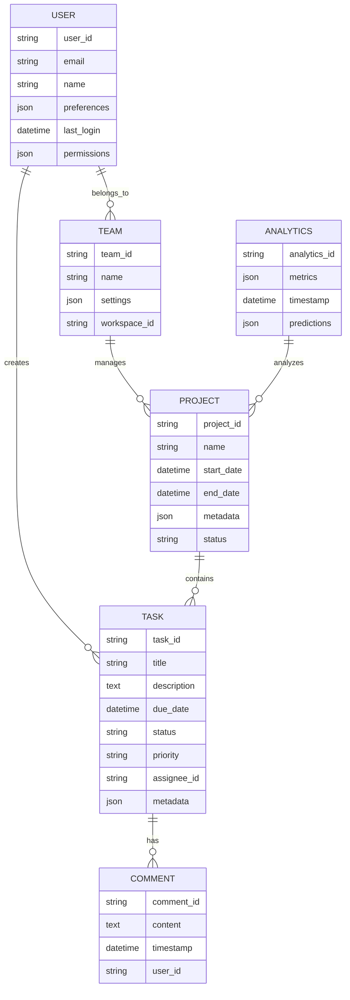
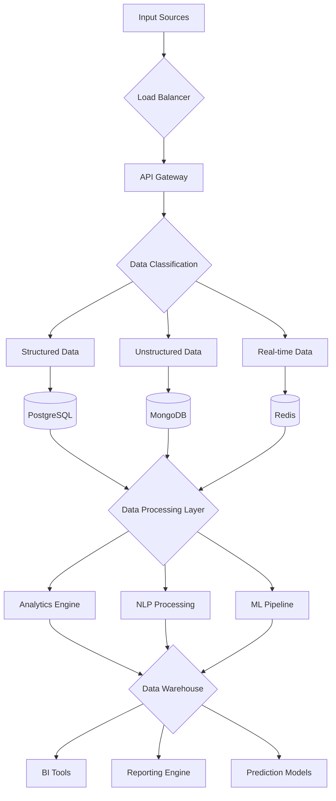

# Product Requirements Document (PRD)

# 1. INTRODUCTION

## 1.1 Purpose

This Software Requirements Specification (SRS) document provides a comprehensive description of the TaskStream AI platform. It details the functional and non-functional requirements for the development team, project stakeholders, and quality assurance teams. The document serves as the primary reference for technical and non-technical audiences to understand the capabilities, constraints, and implementation details of the system.

## 1.2 Scope

TaskStream AI is an intelligent project management platform that transforms traditional project management through AI-powered automation and natural language processing. The system encompasses:

- Automated task extraction and management from various communication channels
- Real-time collaboration and documentation generation
- Predictive analytics for resource allocation and bottleneck prevention
- Machine learning-based workflow optimization
- Automated progress tracking and reporting

Key benefits include:
- Reduced manual project management overhead
- Improved team productivity through automated task management
- Enhanced resource utilization through AI-driven insights
- Streamlined communication and documentation processes
- Proactive risk management through predictive analytics

The platform integrates with existing communication tools and project management systems while providing its own suite of collaboration features. It is designed to scale from small teams to enterprise-level organizations, with customizable workflows and security controls.

# 2. PRODUCT DESCRIPTION

## 2.1 Product Perspective

TaskStream AI operates as a cloud-based SaaS platform that integrates with an organization's existing technology ecosystem. The system:

- Functions as a standalone project management solution while offering seamless integration with common enterprise tools
- Interfaces with email systems, chat platforms, video conferencing tools, and calendar applications
- Maintains bi-directional synchronization with popular project management tools like Jira, Asana, and Microsoft Project
- Leverages cloud infrastructure for scalability and reliability
- Provides REST APIs and webhooks for custom integrations
- Operates within existing organizational security frameworks and compliance requirements

## 2.2 Product Functions

The core functions of TaskStream AI include:

1. Natural Language Processing
   - Automatic task extraction from communications
   - Context-aware task classification and prioritization
   - Meeting transcription and action item identification
   - Sentiment analysis for team engagement monitoring

2. Project Management Automation
   - Dynamic task creation and assignment
   - Automated timeline generation and updates
   - Resource allocation optimization
   - Progress tracking and reporting
   - Documentation generation and maintenance

3. Predictive Analytics
   - Resource utilization forecasting
   - Bottleneck prediction and prevention
   - Risk assessment and mitigation suggestions
   - Team capacity planning
   - Project timeline optimization

4. Collaboration Tools
   - Real-time document collaboration
   - Integrated team messaging
   - Visual project boards and timelines
   - Automated status updates
   - Cross-team dependency management

## 2.3 User Characteristics

1. Project Managers
   - Primary platform administrators
   - Advanced understanding of project management methodologies
   - Responsible for configuration and oversight
   - Needs: comprehensive reporting, resource management, risk monitoring

2. Team Members
   - Regular platform users
   - Various technical expertise levels
   - Focus on task execution and collaboration
   - Needs: simple task management, clear communication, progress tracking

3. Executives/Stakeholders
   - Occasional platform users
   - Limited technical expertise
   - Interest in high-level progress and metrics
   - Needs: executive dashboards, summary reports, strategic insights

4. System Administrators
   - Technical experts
   - Responsible for integration and maintenance
   - Needs: security controls, user management, system monitoring

## 2.4 Constraints

1. Technical Constraints
   - Must support major web browsers (Chrome, Firefox, Safari, Edge)
   - Maximum response time of 2 seconds for standard operations
   - 99.9% system availability requirement
   - Data retention compliance with GDPR and CCPA

2. Security Constraints
   - SOC 2 Type II compliance requirement
   - End-to-end encryption for sensitive data
   - Multi-factor authentication support
   - Regular security audits and penetration testing

3. Business Constraints
   - Initial release timeline of 12 months
   - Integration with minimum 5 major project management tools
   - Support for multiple languages and time zones
   - Scalability to 100,000+ concurrent users

## 2.5 Assumptions and Dependencies

Assumptions:
- Users have stable internet connectivity
- Organizations have modern web browsers
- Basic project management knowledge exists within teams
- Email and calendar systems are accessible via API
- Teams are willing to adopt AI-assisted workflow changes

Dependencies:
- Cloud infrastructure providers (AWS/Azure/GCP)
- Third-party API services for integrations
- Natural Language Processing models and updates
- Machine learning training data availability
- External authentication services
- Communication platform APIs
- Database management systems
- Content delivery networks

# 3. PROCESS FLOWCHART

# 4. FUNCTIONAL REQUIREMENTS

## 4.1 Natural Language Processing Engine

### ID: FR-NLP-001
### Description
Core NLP system that processes text from various communication channels to extract actionable information.
### Priority: Critical
### Requirements

| ID | Requirement | Priority |
|---|---|---|
| FR-NLP-001.1 | Process text from emails, chat messages, and meeting transcripts | High |
| FR-NLP-001.2 | Identify and extract tasks with 95% accuracy | Critical |
| FR-NLP-001.3 | Detect task deadlines, assignees, and dependencies | High |
| FR-NLP-001.4 | Support multiple languages (English, Spanish, French, German) | Medium |
| FR-NLP-001.5 | Maintain context awareness across conversation threads | High |

## 4.2 Task Management System

### ID: FR-TMS-002
### Description
Automated system for task creation, assignment, and tracking.
### Priority: Critical
### Requirements

| ID | Requirement | Priority |
|---|---|---|
| FR-TMS-002.1 | Automatically create tasks from extracted information | Critical |
| FR-TMS-002.2 | Assign tasks based on team member expertise and capacity | High |
| FR-TMS-002.3 | Track task dependencies and critical path | High |
| FR-TMS-002.4 | Generate and update project timelines automatically | High |
| FR-TMS-002.5 | Provide real-time task status updates | Medium |

## 4.3 AI Analytics Engine

### ID: FR-ANA-003
### Description
Predictive analytics system for resource optimization and risk management.
### Priority: High
### Requirements

| ID | Requirement | Priority |
|---|---|---|
| FR-ANA-003.1 | Predict resource bottlenecks with 85% accuracy | High |
| FR-ANA-003.2 | Generate resource utilization forecasts | High |
| FR-ANA-003.3 | Identify potential project risks | High |
| FR-ANA-003.4 | Suggest process optimizations based on historical data | Medium |
| FR-ANA-003.5 | Calculate project completion probabilities | Medium |

## 4.4 Integration Framework

### ID: FR-INT-004
### Description
System for connecting with external tools and platforms.
### Priority: High
### Requirements

| ID | Requirement | Priority |
|---|---|---|
| FR-INT-004.1 | Integrate with major email providers (Gmail, Outlook) | Critical |
| FR-INT-004.2 | Connect with chat platforms (Slack, Teams, Discord) | High |
| FR-INT-004.3 | Sync with project management tools (Jira, Asana) | High |
| FR-INT-004.4 | Support calendar integration (Google, Outlook) | Medium |
| FR-INT-004.5 | Provide REST API for custom integrations | Medium |

## 4.5 Collaboration Tools

### ID: FR-COL-005
### Description
Real-time collaboration features for team communication and documentation.
### Priority: High
### Requirements

| ID | Requirement | Priority |
|---|---|---|
| FR-COL-005.1 | Enable real-time document editing | High |
| FR-COL-005.2 | Provide team chat functionality | High |
| FR-COL-005.3 | Support video conferencing integration | Medium |
| FR-COL-005.4 | Generate automated meeting minutes | Medium |
| FR-COL-005.5 | Maintain version control for documents | Medium |

## 4.6 Reporting System

### ID: FR-REP-006
### Description
Automated reporting and analytics dashboard system.
### Priority: Medium
### Requirements

| ID | Requirement | Priority |
|---|---|---|
| FR-REP-006.1 | Generate automated progress reports | High |
| FR-REP-006.2 | Provide customizable dashboards | High |
| FR-REP-006.3 | Export reports in multiple formats (PDF, Excel, CSV) | Medium |
| FR-REP-006.4 | Schedule automated report distribution | Medium |
| FR-REP-006.5 | Support custom report templates | Low |

# 5. NON-FUNCTIONAL REQUIREMENTS

## 5.1 Performance Requirements

| ID | Requirement | Target Metric |
|---|---|---|
| NFR-PER-001 | Maximum page load time | < 2 seconds |
| NFR-PER-002 | API response time | < 500ms |
| NFR-PER-003 | NLP processing time | < 3 seconds per request |
| NFR-PER-004 | Concurrent user support | 100,000+ users |
| NFR-PER-005 | Database query response | < 100ms |
| NFR-PER-006 | File upload/download speed | 10MB/s minimum |
| NFR-PER-007 | Real-time sync latency | < 1 second |
| NFR-PER-008 | Memory usage per user session | < 256MB |

## 5.2 Safety Requirements

| ID | Requirement | Description |
|---|---|---|
| NFR-SAF-001 | Data backup frequency | Hourly incremental, daily full backup |
| NFR-SAF-002 | Disaster recovery | Recovery Time Objective (RTO) < 4 hours |
| NFR-SAF-003 | Data redundancy | Geographic redundancy across 3 regions |
| NFR-SAF-004 | Failover capability | Automatic failover with < 5 minute transition |
| NFR-SAF-005 | Data corruption prevention | Checksums and validation for all data transfers |
| NFR-SAF-006 | System state monitoring | Real-time monitoring with automated alerts |

## 5.3 Security Requirements

| ID | Requirement | Description |
|---|---|---|
| NFR-SEC-001 | Authentication | Multi-factor authentication support |
| NFR-SEC-002 | Authorization | Role-based access control (RBAC) |
| NFR-SEC-003 | Data encryption | AES-256 encryption at rest and in transit |
| NFR-SEC-004 | Session management | Automatic timeout after 30 minutes of inactivity |
| NFR-SEC-005 | Audit logging | Comprehensive audit trails for all system actions |
| NFR-SEC-006 | Penetration testing | Quarterly security assessments |
| NFR-SEC-007 | Vulnerability scanning | Weekly automated security scans |
| NFR-SEC-008 | API security | OAuth 2.0 and API key authentication |

## 5.4 Quality Requirements

### 5.4.1 Availability
- System uptime: 99.9% (excluding planned maintenance)
- Planned maintenance windows: Maximum 4 hours monthly
- Service degradation: < 0.1% of total operation time

### 5.4.2 Maintainability
- Code coverage: Minimum 80%
- Documentation: Updated within 24 hours of changes
- Technical debt: < 5% of development time
- Module coupling: Maximum 30% interdependency

### 5.4.3 Usability
- Learning curve: < 2 hours for basic operations
- Error rate: < 1% for common tasks
- User satisfaction: > 85% positive feedback
- Accessibility: WCAG 2.1 Level AA compliance

### 5.4.4 Scalability
- Horizontal scaling: Support for 200% peak load
- Storage scalability: Up to 100TB per tenant
- Network bandwidth: Auto-scaling up to 10Gbps
- Database scaling: Automatic sharding support

### 5.4.5 Reliability
- Mean Time Between Failures (MTBF): > 720 hours
- Mean Time To Recovery (MTTR): < 30 minutes
- Error handling: 100% of edge cases documented
- Data integrity: 99.999% accuracy

## 5.5 Compliance Requirements

| ID | Requirement | Description |
|---|---|---|
| NFR-COM-001 | Data privacy | GDPR and CCPA compliance |
| NFR-COM-002 | Security standards | SOC 2 Type II certification |
| NFR-COM-003 | Industry standards | ISO 27001 compliance |
| NFR-COM-004 | Accessibility | Section 508 compliance |
| NFR-COM-005 | Data retention | Configurable retention policies |
| NFR-COM-006 | Audit compliance | Support for external audits |
| NFR-COM-007 | Data sovereignty | Regional data storage compliance |
| NFR-COM-008 | Export control | ITAR and EAR compliance where applicable |

# 6. DATA REQUIREMENTS

## 6.1 Data Models

## 6.2 Data Storage

### 6.2.1 Primary Storage
- PostgreSQL for structured relational data
- MongoDB for document storage and flexible schemas
- Redis for caching and real-time data
- Elasticsearch for full-text search and analytics

### 6.2.2 Storage Requirements
| Data Type | Storage System | Retention Period | Backup Frequency |
|-----------|---------------|------------------|------------------|
| User Data | PostgreSQL | Lifetime | Daily |
| Project Data | PostgreSQL | 7 years | Daily |
| Communications | MongoDB | 3 years | Daily |
| Analytics Data | MongoDB | 2 years | Weekly |
| Audit Logs | Elasticsearch | 5 years | Daily |
| Cache Data | Redis | 24 hours | None |

### 6.2.3 Backup Strategy
- Automated daily full backups
- Continuous incremental backups
- Cross-region replication
- Point-in-time recovery capability
- 30-day backup retention minimum

## 6.3 Data Processing

### 6.3.1 Data Security
| Layer | Security Measure |
|-------|-----------------|
| Transport | TLS 1.3 encryption |
| Storage | AES-256 encryption at rest |
| Application | Row-level security |
| Database | Column-level encryption |
| Backup | Encrypted snapshots |

### 6.3.2 Data Processing Requirements
- Maximum latency of 100ms for real-time data processing
- Batch processing window of 4 hours for analytics
- Data validation and sanitization at ingestion
- Automatic data classification and tagging
- Real-time data synchronization across regions

### 6.3.3 Data Integrity
- Checksums for all data transfers
- Version control for all data modifications
- Audit trails for data access and changes
- Automated data consistency checks
- Data quality monitoring and alerting

### 6.3.4 Data Access Patterns
| Access Type | Caching Strategy | Update Frequency |
|-------------|------------------|------------------|
| Read-heavy | Redis cache | Real-time |
| Write-heavy | Write-through cache | Immediate |
| Analytics | Materialized views | Hourly |
| Search | Elasticsearch index | Near real-time |
| Reports | Pre-computed aggregates | Daily |

# 7. EXTERNAL INTERFACES

## 7.1 User Interfaces

### 7.1.1 Web Application Interface

| Component | Requirements |
|-----------|--------------|
| Resolution Support | Minimum 1280x720, responsive up to 4K |
| Browser Compatibility | Chrome 90+, Firefox 88+, Safari 14+, Edge 90+ |
| Accessibility | WCAG 2.1 Level AA compliant |
| Theme Support | Light/Dark modes, customizable color schemes |
| Response Time | < 200ms for UI interactions |

### 7.1.2 Mobile Interface

| Component | Requirements |
|-----------|--------------|
| Platform Support | iOS 14+, Android 10+ |
| Screen Sizes | 320px to 428px width (mobile), 768px to 1024px (tablet) |
| Orientation | Support for both portrait and landscape |
| Touch Interface | Multi-touch gesture support |
| Offline Mode | Basic functionality without internet connection |

## 7.2 Hardware Interfaces

### 7.2.1 Storage Systems

| Component | Specification |
|-----------|--------------|
| Primary Storage | NVMe SSD with minimum 5000 IOPS |
| Backup Storage | SAS/SATA drives in RAID configuration |
| Network Storage | 10Gbps NAS/SAN connectivity |
| Cache Storage | High-speed SSD cache layer |

### 7.2.2 Network Hardware

| Component | Specification |
|-----------|--------------|
| Network Cards | 10Gbps Ethernet minimum |
| Load Balancers | Hardware-based with SSL acceleration |
| Firewalls | Next-generation firewall appliances |
| CDN Edge Nodes | Global distribution with < 50ms latency |

## 7.3 Software Interfaces

### 7.3.1 Integration APIs

| System | Interface Type | Protocol | Data Format |
|--------|---------------|-----------|-------------|
| Email Systems | REST API | HTTPS | JSON/MIME |
| Chat Platforms | WebSocket/REST | WSS/HTTPS | JSON |
| Project Management Tools | REST API | HTTPS | JSON |
| Calendar Services | REST API | HTTPS | iCal/JSON |
| Authentication Services | OAuth 2.0 | HTTPS | JWT |

### 7.3.2 Database Interfaces

| Database | Interface Type | Protocol | Purpose |
|----------|---------------|-----------|----------|
| PostgreSQL | Native Driver | TCP | Primary Data |
| MongoDB | Native Driver | TCP | Document Storage |
| Redis | Native Driver | TCP | Caching |
| Elasticsearch | REST API | HTTPS | Search/Analytics |

## 7.4 Communication Interfaces

### 7.4.1 Network Protocols

| Protocol | Usage | Port |
|----------|-------|------|
| HTTPS | Web Traffic | 443 |
| WSS | Real-time Updates | 443 |
| SMTP | Email Integration | 587 |
| AMQP | Message Queue | 5672 |
| gRPC | Microservice Communication | 50051 |

### 7.4.2 API Specifications

| API Type | Format | Authentication |
|----------|--------|----------------|
| REST APIs | OpenAPI 3.0 | JWT/API Keys |
| GraphQL | Schema | JWT |
| WebSocket | JSON | JWT |
| Webhooks | JSON | HMAC |
| Event Stream | SSE | JWT |

### 7.4.3 Data Exchange Formats

| Format | Usage | Validation |
|--------|-------|------------|
| JSON | API Responses | JSON Schema |
| Protocol Buffers | Internal Services | .proto files |
| MessagePack | Binary Data | Schema Registry |
| CSV | Data Export | RFC 4180 |
| XML | Legacy Systems | XSD Schema |

# 8. APPENDICES

## 8.1 GLOSSARY

| Term | Definition |
|------|------------|
| Action Item | A specific task or deliverable extracted from communications or meetings |
| Bottleneck | A constraint in the workflow that limits overall system throughput |
| Critical Path | The sequence of dependent tasks that determine the minimum time needed to complete the project |
| Natural Language Processing | Technology that enables computers to understand and process human language |
| Resource Utilization | The percentage of available work time that a resource is actively engaged in project tasks |
| Sentiment Analysis | Process of determining the emotional tone behind communications |
| Task Classification | Automated categorization of tasks based on content, priority, and context |
| Workflow Optimization | Process of improving task sequences and resource allocation for maximum efficiency |

## 8.2 ACRONYMS

| Acronym | Definition |
|---------|------------|
| AI | Artificial Intelligence |
| API | Application Programming Interface |
| BI | Business Intelligence |
| CCPA | California Consumer Privacy Act |
| CDN | Content Delivery Network |
| GDPR | General Data Protection Regulation |
| HMAC | Hash-based Message Authentication Code |
| IOPS | Input/Output Operations Per Second |
| ITAR | International Traffic in Arms Regulations |
| JWT | JSON Web Token |
| ML | Machine Learning |
| MTBF | Mean Time Between Failures |
| MTTR | Mean Time To Recovery |
| NAS | Network Attached Storage |
| NLP | Natural Language Processing |
| NVMe | Non-Volatile Memory Express |
| RAID | Redundant Array of Independent Disks |
| RBAC | Role-Based Access Control |
| REST | Representational State Transfer |
| RTO | Recovery Time Objective |
| SAN | Storage Area Network |
| SLA | Service Level Agreement |
| SOC | System and Organization Controls |
| SSE | Server-Sent Events |
| TLS | Transport Layer Security |
| WCAG | Web Content Accessibility Guidelines |
| WSS | WebSocket Secure |

## 8.3 ADDITIONAL REFERENCES

| Category | Reference |
|----------|-----------|
| Security Standards | NIST Cybersecurity Framework v1.1 |
| API Design | REST API Design Rulebook (O'Reilly) |
| Database | PostgreSQL 14 Documentation |
| Cloud Infrastructure | AWS Well-Architected Framework |
| Machine Learning | TensorFlow Documentation |
| Project Management | PMBOK Guide - Seventh Edition |
| Compliance | ISO/IEC 27001:2013 |
| Performance | Google Web Vitals Documentation |
| Accessibility | WCAG 2.1 Guidelines |
| Development | Microservices Architecture (Martin Fowler) |