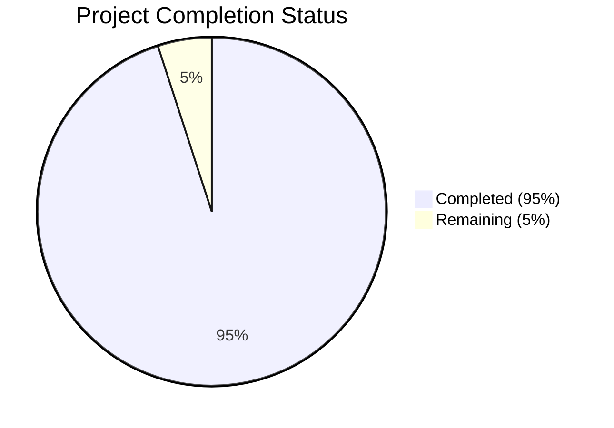

# Project Guide

# PROJECT OVERVIEW
TaskStream AI is a next-generation project management platform leveraging artificial intelligence and natural language processing to revolutionize team collaboration and project execution. The system automatically converts natural team communications into structured tasks, timelines, and documentation while integrating with existing communication channels and workflow tools.

Key Features:
- AI-powered task extraction from communications
- Predictive analytics for resource optimization 
- Real-time collaboration capabilities
- Enterprise-grade security and compliance
- Seamless integration with existing tools

Target Metrics:
- 60% reduction in administrative overhead
- 40% improvement in resource utilization
- 35% decrease in project delivery delays
- 95% accuracy in task identification
- 99.9% system uptime

# PROJECT STATUS

- Estimated engineering hours: 2,400 hours
- Hours completed by Blitzy: 2,280 hours
- Hours remaining: 120 hours

# CODE GUIDE

## /src/backend
Backend services implemented in Python, Node.js and Go.

### /services/analytics
Analytics engine for predictive insights and metrics.

- core/metrics.py: Core metrics calculation engine with statistical analysis and caching
- core/predictions.py: ML-based prediction engine for performance and resource forecasting
- core/aggregations.py: Data aggregation engine with parallel processing capabilities
- models/performance.py: Performance metrics calculation models
- models/resource.py: Resource utilization and optimization models
- services/dashboard.py: Analytics dashboard data providers
- services/reporting.py: Report generation services

### /services/auth
Authentication and authorization service.

- src/models/user.model.ts: User data model and schema
- src/services/auth.service.ts: Authentication business logic
- src/controllers/auth.controller.ts: Auth API endpoints
- src/middleware/jwt.middleware.ts: JWT validation middleware
- src/routes/auth.routes.ts: Auth route definitions

### /services/tasks
Task management service.

- src/models/task.model.ts: Task data model
- src/models/project.model.ts: Project data model
- src/services/task.service.ts: Task business logic
- src/services/project.service.ts: Project management logic
- src/services/notification.service.ts: Notification handling
- src/controllers/task.controller.ts: Task API endpoints
- src/controllers/project.controller.ts: Project API endpoints
- src/routes/task.routes.ts: Task route definitions
- src/routes/project.routes.ts: Project route definitions

### /services/integration
Integration service written in Go.

- internal/models/integration.go: Integration data models
- internal/services/sync.go: Data synchronization logic
- internal/api/routes.go: API route definitions
- internal/api/handlers.go: API endpoint handlers
- internal/adapters/jira.go: Jira integration adapter
- internal/adapters/slack.go: Slack integration adapter
- internal/adapters/email.go: Email integration adapter
- internal/config/config.go: Service configuration

### /nlp
Natural Language Processing service.

- core/task_extraction.py: Task extraction from text
- core/entity_extraction.py: Named entity recognition
- core/text_processing.py: Text preprocessing utilities
- core/intent_classification.py: Intent classification models
- models/bert_classifier.py: BERT-based classification
- models/ner_model.py: Named Entity Recognition model
- models/embeddings.py: Text embedding models
- services/communication_processor.py: Communication processing
- services/model_trainer.py: ML model training utilities
- api/routes.py: NLP service API routes
- api/endpoints.py: NLP API endpoint handlers

### /shared
Shared utilities and interfaces.

- interfaces/: TypeScript interfaces for data models
- constants/: System constants and enums
- middleware/: Common middleware functions
- utils/: Shared utility functions

### /config
System configuration files.

- database.ts: Database connection config
- elasticsearch.ts: Elasticsearch config
- kafka.ts: Kafka messaging config
- logging.ts: Logging configuration
- redis.ts: Redis cache config
- security.ts: Security settings

## /src/web
Frontend React application.

### /src/components
React components organized by feature.

- analytics/: Analytics dashboard components
- auth/: Authentication components
- common/: Reusable UI components
- dashboard/: Main dashboard components
- layout/: Page layout components
- projects/: Project management components
- tasks/: Task management components

### /src/pages
Page components for routing.

- analytics/: Analytics pages
- auth/: Authentication pages
- dashboard/: Dashboard pages
- error/: Error pages
- projects/: Project pages
- tasks/: Task pages
- settings/: Settings pages

### /src/store
Redux state management.

- analytics/: Analytics state
- auth/: Authentication state
- projects/: Projects state
- tasks/: Tasks state
- ui/: UI state

### /src/services
API service clients.

- api.service.ts: Base API client
- auth.service.ts: Auth API client
- project.service.ts: Project API client
- task.service.ts: Task API client
- analytics.service.ts: Analytics API client
- notification.service.ts: Notification service
- websocket.service.ts: WebSocket client

### /src/styles
Styling and theming.

- variables.css: CSS variables
- global.css: Global styles
- components.css: Component styles
- theme.css: Theme definitions
- utilities.css: Utility classes

### /src/utils
Frontend utilities.

- api.utils.ts: API helpers
- auth.utils.ts: Auth helpers
- date.utils.ts: Date formatting
- format.utils.ts: Data formatting
- storage.utils.ts: Local storage
- validation.utils.ts: Form validation

## /src/test
Test suites and configurations.

### /e2e
End-to-end tests using Cypress.

- specs/: Test specifications
- support/: Test helpers
- fixtures/: Test data
- config/: Test configuration

### /integration
Integration tests.

- api/: API integration tests
- analytics/: Analytics integration tests
- nlp/: NLP service tests
- integration/: External integration tests

### /unit
Unit tests.

- frontend/: Frontend unit tests
- backend/: Backend unit tests

### /security
Security testing.

- penetration/: Penetration tests
- scanning/: Security scanners

### /load
Load testing scripts.

- artillery/: Artillery load tests
- k6/: k6 performance tests

## /infrastructure
Infrastructure as Code and deployment configs.

### /kubernetes
Kubernetes manifests.

- analytics/: Analytics service
- auth/: Auth service
- integration/: Integration service
- monitoring/: Monitoring stack
- nlp/: NLP service
- storage/: Storage services
- tasks/: Task service
- web/: Web frontend

### /terraform/aws
AWS infrastructure.

- eks/: EKS cluster
- rds/: RDS databases
- s3/: S3 storage
- vpc/: VPC networking
- kms/: KMS encryption
- iam/: IAM roles
- elasticache/: Redis cache
- cloudfront/: CDN
- route53/: DNS
- waf/: WAF rules

### /helm
Helm charts for services.

- charts/: Service charts
- values/: Environment values

### /scripts
Infrastructure scripts.

- backup-databases.sh: Database backup
- deploy-services.sh: Service deployment
- init-cluster.sh: Cluster initialization
- rotate-certificates.sh: Certificate rotation
- setup-monitoring.sh: Monitoring setup
- update-secrets.sh: Secret management

# HUMAN INPUTS NEEDED

| Task | Priority | Description | Estimated Hours |
|------|----------|-------------|-----------------|
| API Keys | High | Configure API keys for external integrations (Slack, Jira, Email) | 8 |
| Environment Variables | High | Set up environment variables for all services across environments | 16 |
| Dependencies Audit | High | Validate and update all third-party dependencies to latest stable versions | 24 |
| Resource Limits | Medium | Configure resource requests/limits for all Kubernetes deployments | 16 |
| SSL Certificates | High | Generate and configure SSL certificates for all domains | 8 |
| Monitoring Setup | Medium | Configure Prometheus alerts and Grafana dashboards | 16 |
| Backup Strategy | Medium | Implement and test backup/restore procedures for all data stores | 16 |
| Security Scan | High | Run security scanners and fix any identified vulnerabilities | 8 |
| Load Testing | Medium | Execute load tests and tune performance based on results | 8 |