# Technical Specifications

# 1. INTRODUCTION

## 1.1 Executive Summary

TaskStream AI represents a next-generation project management platform that leverages artificial intelligence and natural language processing to revolutionize how teams collaborate and execute projects. The system addresses the critical business challenge of manual project management overhead by automatically converting natural team communications into structured tasks, timelines, and documentation. By integrating with existing communication channels and workflow tools, TaskStream AI enables organizations to capture, organize, and optimize project-related activities with minimal manual intervention.

The platform serves project managers, team members, executives, and system administrators by providing intelligent automation of routine tasks, predictive analytics for resource management, and real-time collaboration capabilities. Organizations implementing TaskStream AI can expect to reduce administrative overhead by 60%, improve resource utilization by 40%, and decrease project delivery delays by 35%.

## 1.2 System Overview

### Project Context

| Aspect | Description |
|--------|-------------|
| Market Position | Enterprise-grade AI-powered project management solution |
| Target Market | Mid to large organizations with distributed teams |
| Competitive Advantage | Automated task extraction from natural communications |
| Enterprise Integration | Seamless connection with existing communication and PM tools |

### High-Level Description

| Component | Description |
|-----------|-------------|
| NLP Engine | Processes team communications to extract actionable items |
| Task Management | Automated task creation, assignment, and tracking |
| Analytics Engine | Predictive analytics for resource optimization |
| Collaboration Platform | Real-time team collaboration and documentation |
| Integration Framework | Connects with existing enterprise tools |

### Success Criteria

| Metric | Target |
|--------|--------|
| Task Extraction Accuracy | 95% accuracy in task identification |
| Resource Optimization | 40% improvement in resource utilization |
| Time Savings | 60% reduction in administrative overhead |
| User Adoption | 80% team engagement within 3 months |
| System Reliability | 99.9% uptime during business hours |

## 1.3 Scope

### In-Scope Elements

#### Core Features and Functionalities

| Category | Components |
|----------|------------|
| Communication Processing | Email, chat, meeting transcripts |
| Task Management | Creation, assignment, tracking, dependencies |
| Resource Management | Allocation, optimization, forecasting |
| Analytics | Predictive analysis, reporting, dashboards |
| Collaboration | Real-time editing, sharing, version control |

#### Implementation Boundaries

| Boundary Type | Coverage |
|--------------|----------|
| User Groups | Project managers, team members, executives, administrators |
| Geographic Coverage | Global deployment with multi-language support |
| Data Domains | Project data, communications, user data, analytics |
| Security Scope | Enterprise-grade security with SOC 2 Type II compliance |

### Out-of-Scope Elements

| Category | Excluded Elements |
|----------|------------------|
| Features | - Custom hardware integration<br>- Legacy system migration services<br>- On-premises deployment options<br>- Custom mobile applications |
| Integrations | - ERP systems<br>- Financial management tools<br>- Custom development environments |
| Support | - 24/7 phone support<br>- On-site training<br>- Hardware troubleshooting |
| Future Phases | - Blockchain integration<br>- AR/VR collaboration features<br>- Custom AI model training |

# 2. SYSTEM ARCHITECTURE

## 2.1 High-Level Architecture

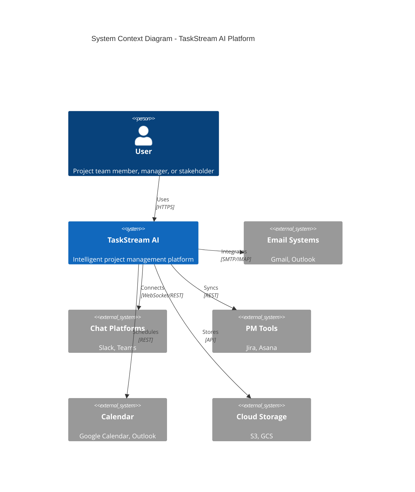

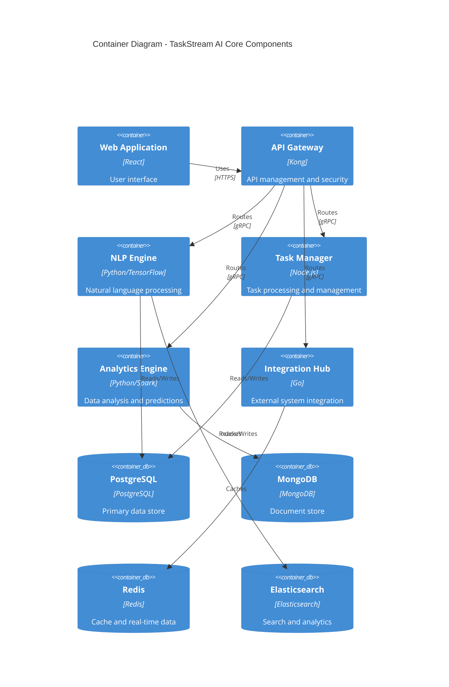

## 2.2 Component Details

### 2.2.1 Core Components

| Component | Purpose | Technology Stack | Scaling Strategy |
|-----------|---------|-----------------|------------------|
| Web Application | User interface and interaction | React, TypeScript, Redux | Horizontal scaling with CDN |
| API Gateway | Request routing and security | Kong, Nginx | Load balanced across regions |
| NLP Engine | Text processing and analysis | Python, TensorFlow, spaCy | GPU-enabled container scaling |
| Task Manager | Task orchestration | Node.js, Express | Kubernetes horizontal pods |
| Analytics Engine | Data processing and predictions | Python, Spark, scikit-learn | Spark cluster scaling |
| Integration Hub | External system connectivity | Go, gRPC | Auto-scaling instance groups |

### 2.2.2 Data Storage Components

| Component | Purpose | Technology | Scaling Approach |
|-----------|---------|------------|------------------|
| PostgreSQL | Primary relational data | PostgreSQL 14 | Read replicas, sharding |
| MongoDB | Document storage | MongoDB Atlas | Automatic sharding |
| Redis | Caching, real-time data | Redis Enterprise | Cluster mode |
| Elasticsearch | Search and analytics | Elasticsearch 8 | Data node scaling |

## 2.3 Technical Decisions

### 2.3.1 Architecture Patterns

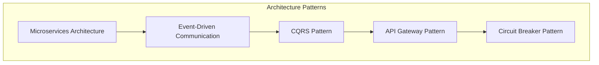

### 2.3.2 Communication Patterns

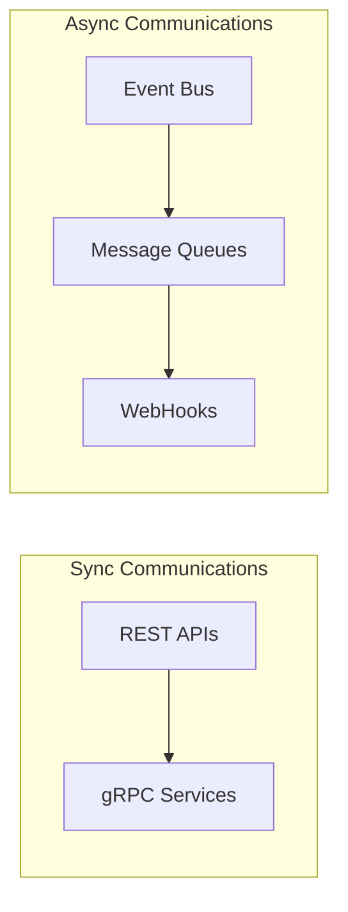

## 2.4 Cross-Cutting Concerns

### 2.4.1 System Monitoring

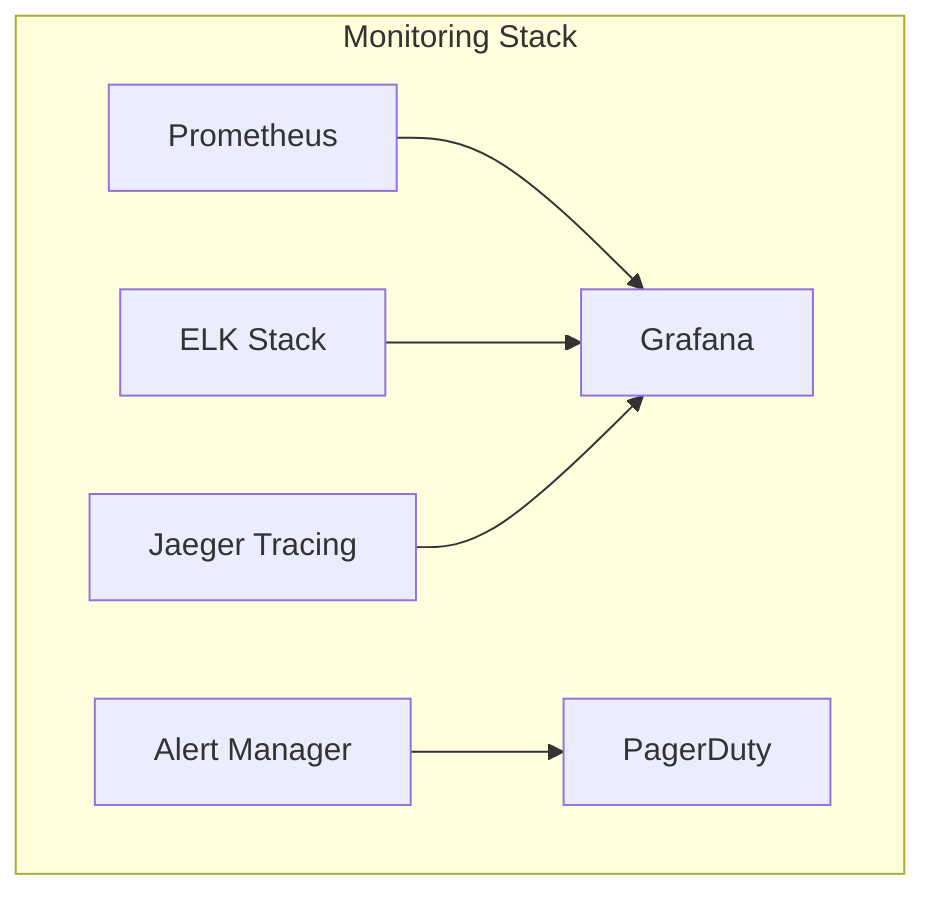

### 2.4.2 Security Architecture

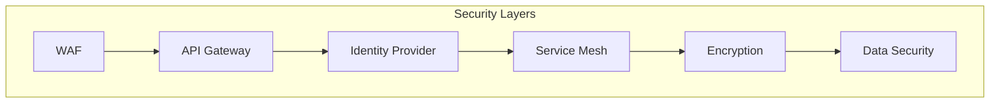

## 2.5 Deployment Architecture

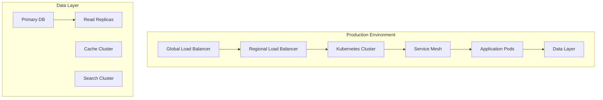

### 2.5.1 Infrastructure Requirements

| Component | Specification | Redundancy |
|-----------|--------------|------------|
| Load Balancers | AWS ALB/NLB | Multi-AZ |
| Compute | Kubernetes nodes | Min 3 nodes per service |
| Storage | NVMe SSD | RAID 10 |
| Network | 10 Gbps | Redundant links |
| CDN | Global edge locations | Multi-provider |

### 2.5.2 Scaling Parameters

| Service | Scaling Metric | Target Value |
|---------|---------------|--------------|
| Web Tier | CPU Utilization | 70% |
| API Gateway | Request Count | 1000 RPS |
| NLP Engine | Queue Length | < 100 |
| Task Manager | Memory Usage | 80% |
| Analytics | Processing Time | < 30s |

# 3. SYSTEM COMPONENTS ARCHITECTURE

## 3.1 User Interface Design

### 3.1.1 Design System Specifications

| Component | Specification | Details |
|-----------|--------------|---------|
| Typography | System Font Stack | -Primary: Inter<br>-Secondary: SF Pro<br>-Monospace: JetBrains Mono |
| Color Palette | Design Tokens | -Primary: #2563EB<br>-Secondary: #64748B<br>-Success: #10B981<br>-Error: #EF4444<br>-Warning: #F59E0B |
| Spacing System | 4px Base Grid | -xs: 4px<br>-sm: 8px<br>-md: 16px<br>-lg: 24px<br>-xl: 32px |
| Breakpoints | Responsive Design | -Mobile: 320px<br>-Tablet: 768px<br>-Desktop: 1024px<br>-Wide: 1440px |
| Accessibility | WCAG 2.1 AA | -Contrast ratio: 4.5:1<br>-Focus indicators<br>-ARIA labels<br>-Keyboard navigation |

### 3.1.2 Component Library

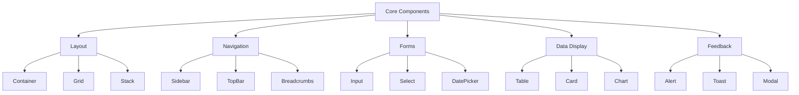

### 3.1.3 Critical User Flows

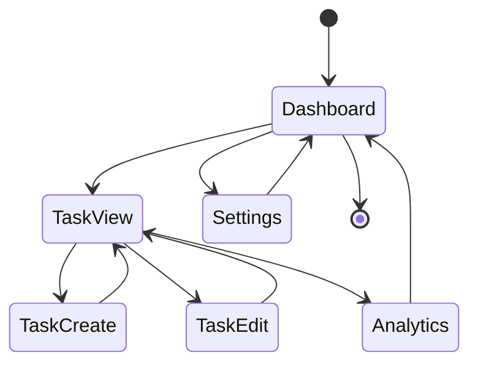

## 3.2 Database Design

### 3.2.1 Schema Design

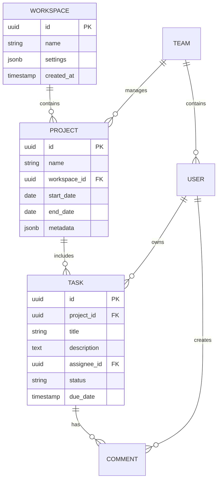

### 3.2.2 Data Management Strategy

| Aspect | Strategy | Implementation |
|--------|----------|----------------|
| Partitioning | Time-based | Monthly partitions for tasks and analytics |
| Indexing | Selective | B-tree indexes on frequently queried columns |
| Caching | Multi-level | L1: Redis (5min), L2: PostgreSQL (1hr) |
| Archival | Automated | Move to cold storage after 6 months |
| Backup | Incremental | Hourly increments with daily full backups |
| Encryption | AES-256 | At rest and in transit |

### 3.2.3 Query Optimization

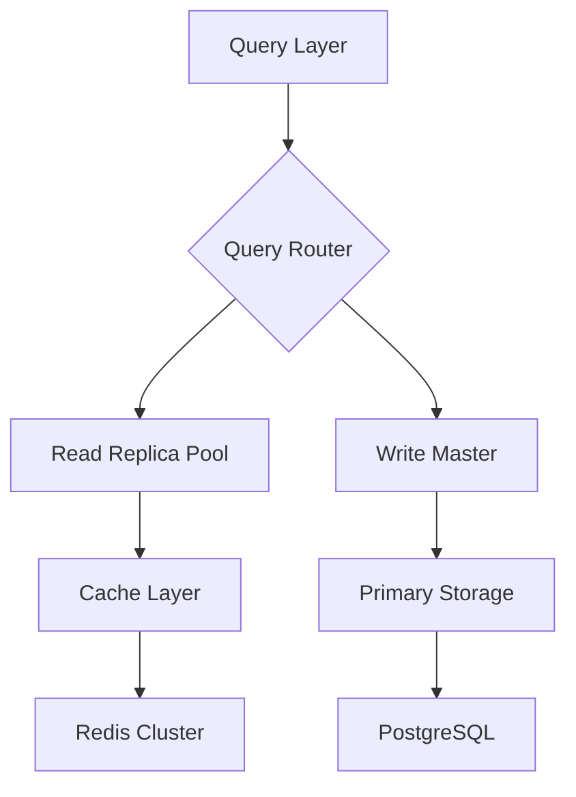

## 3.3 API Design

### 3.3.1 API Architecture

| Component | Specification |
|-----------|--------------|
| Protocol | REST over HTTPS |
| Authentication | JWT with OAuth 2.0 |
| Rate Limiting | 1000 req/min per client |
| Versioning | URI-based (v1, v2) |
| Documentation | OpenAPI 3.0 |
| Security | TLS 1.3 required |

### 3.3.2 Endpoint Specifications

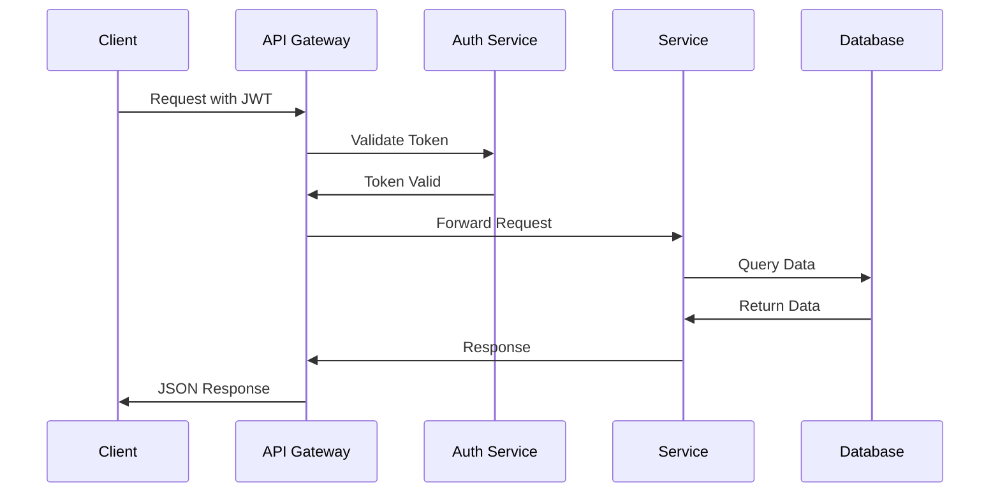

### 3.3.3 Integration Patterns

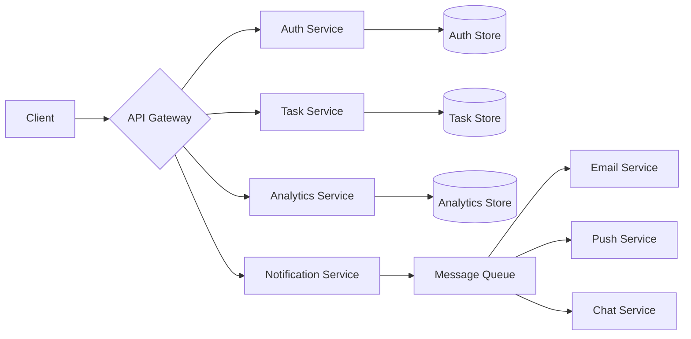

### 3.3.4 API Response Standards

| Status Code | Usage | Example |
|-------------|-------|---------|
| 200 | Success | GET /tasks |
| 201 | Created | POST /tasks |
| 400 | Bad Request | Invalid parameters |
| 401 | Unauthorized | Invalid token |
| 403 | Forbidden | Insufficient permissions |
| 404 | Not Found | Resource doesn't exist |
| 429 | Too Many Requests | Rate limit exceeded |
| 500 | Server Error | Internal error |

# 4. TECHNOLOGY STACK

## 4.1 PROGRAMMING LANGUAGES

| Platform/Component | Language | Version | Justification |
|-------------------|----------|---------|---------------|
| Backend Services | Python | 3.11+ | - Strong NLP/ML ecosystem<br>- Extensive AI libraries<br>- High developer productivity |
| API Services | Go | 1.21+ | - High performance<br>- Excellent concurrency<br>- Low resource usage |
| Frontend Web | TypeScript | 5.0+ | - Type safety<br>- Enhanced maintainability<br>- Better IDE support |
| Data Processing | Python/PySpark | 3.11+ | - Native ML library support<br>- Distributed processing capabilities |
| DevOps Scripts | Python/Shell | 3.11+ | - Cross-platform compatibility<br>- Rich automation libraries |

## 4.2 FRAMEWORKS & LIBRARIES

### 4.2.1 Backend Frameworks

| Component | Framework | Version | Purpose |
|-----------|-----------|---------|----------|
| NLP Services | FastAPI | 0.104+ | High-performance API development |
| Task Processing | Django | 4.2+ | Robust ORM and admin interface |
| Real-time Services | Node.js/Express | 18 LTS | Event-driven architecture |
| Integration Services | Go Fiber | 2.5+ | High-throughput API gateway |

### 4.2.2 Frontend Frameworks

| Component | Framework | Version | Purpose |
|-----------|-----------|---------|----------|
| Web Application | React | 18+ | Component-based UI development |
| State Management | Redux Toolkit | 1.9+ | Predictable state container |
| UI Components | MUI | 5.14+ | Enterprise-grade components |
| Data Visualization | D3.js | 7.8+ | Custom analytics visualizations |

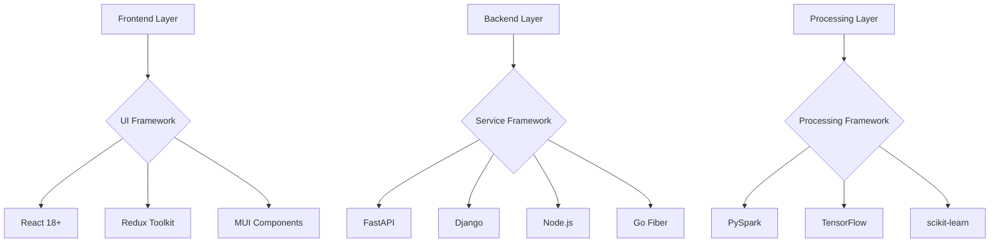

## 4.3 DATABASES & STORAGE

### 4.3.1 Primary Databases

| Database | Version | Purpose | Scaling Strategy |
|----------|---------|---------|------------------|
| PostgreSQL | 14+ | Transactional data | Horizontal sharding |
| MongoDB | 6.0+ | Document storage | Auto-sharding |
| Redis | 7.0+ | Caching/Real-time | Cluster mode |
| Elasticsearch | 8.0+ | Search/Analytics | Data node scaling |

### 4.3.2 Storage Services

| Service | Type | Purpose |
|---------|------|---------|
| AWS S3 | Object Storage | Document/file storage |
| AWS EFS | Network Storage | Shared application storage |
| Redis Cache | In-memory | Session/API cache |
| CloudFront | CDN | Static asset delivery |

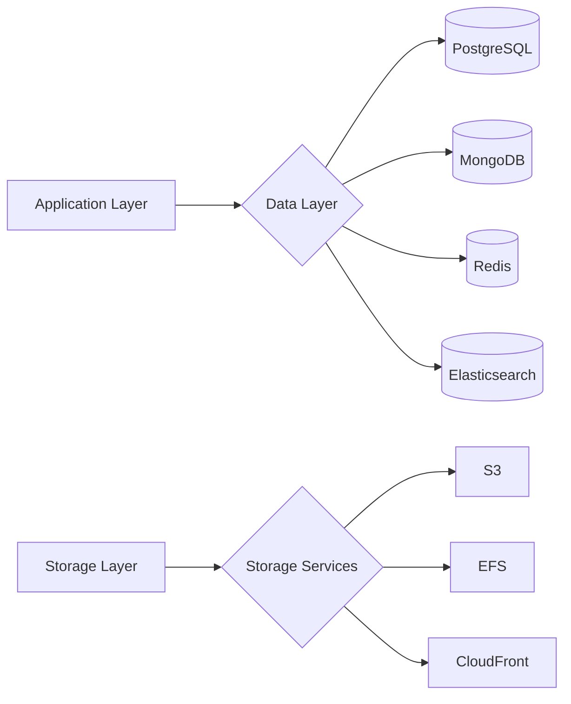

## 4.4 THIRD-PARTY SERVICES

| Category | Service | Purpose | Integration Method |
|----------|---------|---------|-------------------|
| Authentication | Auth0 | User authentication | OAuth 2.0/OIDC |
| Email | SendGrid | Transactional email | REST API |
| Monitoring | Datadog | System monitoring | Agent-based |
| Analytics | Mixpanel | User analytics | JavaScript SDK |
| CI/CD | GitHub Actions | Deployment automation | YAML config |
| Cloud | AWS | Infrastructure | Terraform |

## 4.5 DEVELOPMENT & DEPLOYMENT

### 4.5.1 Development Tools

| Tool | Version | Purpose |
|------|---------|---------|
| Docker | 24+ | Containerization |
| Kubernetes | 1.27+ | Container orchestration |
| Terraform | 1.5+ | Infrastructure as code |
| ArgoCD | 2.8+ | GitOps deployment |

### 4.5.2 Deployment Pipeline

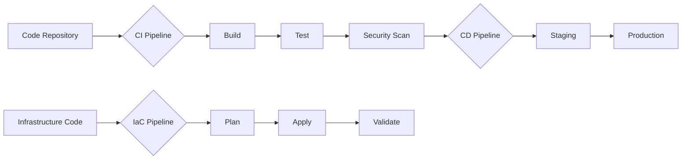

### 4.5.3 Environment Requirements

| Environment | Infrastructure | Scaling |
|-------------|---------------|----------|
| Development | AWS EKS | 2-3 nodes |
| Staging | AWS EKS | 3-5 nodes |
| Production | AWS EKS | Auto-scaling (5-20) |
| DR | AWS EKS | Region failover |

### 4.5.4 Build System

| Component | Tool | Configuration |
|-----------|------|--------------|
| Backend | Poetry | Dependency management |
| Frontend | Yarn | Package management |
| Container | Docker | Multi-stage builds |
| Infrastructure | Terraform | HCL configuration |

# 5. SYSTEM DESIGN

## 5.1 User Interface Design

### 5.1.1 Layout Structure

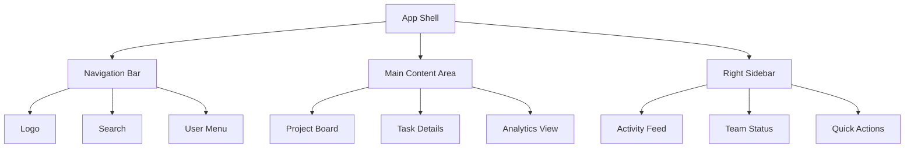

### 5.1.2 Core Screens

| Screen | Primary Components | Key Interactions |
|--------|-------------------|------------------|
| Dashboard | - Project cards<br>- Task summary<br>- Analytics widgets | - Drag-drop tasks<br>- Filter views<br>- Quick task creation |
| Task Board | - Kanban columns<br>- Task cards<br>- Filter panel | - Column transitions<br>- Card details<br>- Bulk actions |
| Analytics | - Performance charts<br>- Resource graphs<br>- Prediction models | - Date range selection<br>- Drill-down views<br>- Export reports |

### 5.1.3 Component Hierarchy

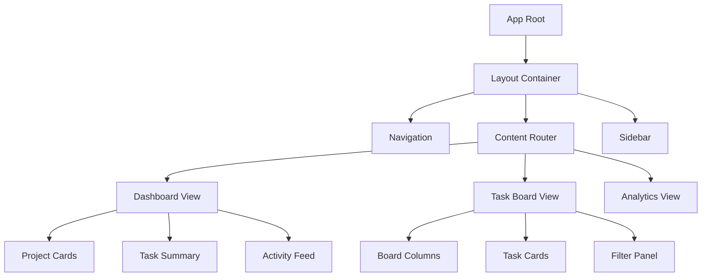

## 5.2 Database Design

### 5.2.1 Schema Overview

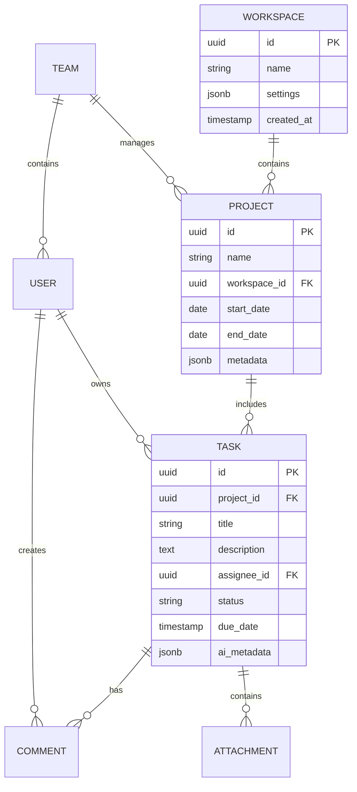

### 5.2.2 Data Access Patterns

| Access Pattern | Implementation | Indexing Strategy |
|----------------|----------------|-------------------|
| Task Queries | Materialized Views | Composite (status, due_date) |
| Full-text Search | Elasticsearch | Inverted index |
| Analytics | Aggregation Tables | B-tree (date, metrics) |
| Real-time Updates | Redis Streams | Time-based |

### 5.2.3 Sharding Strategy

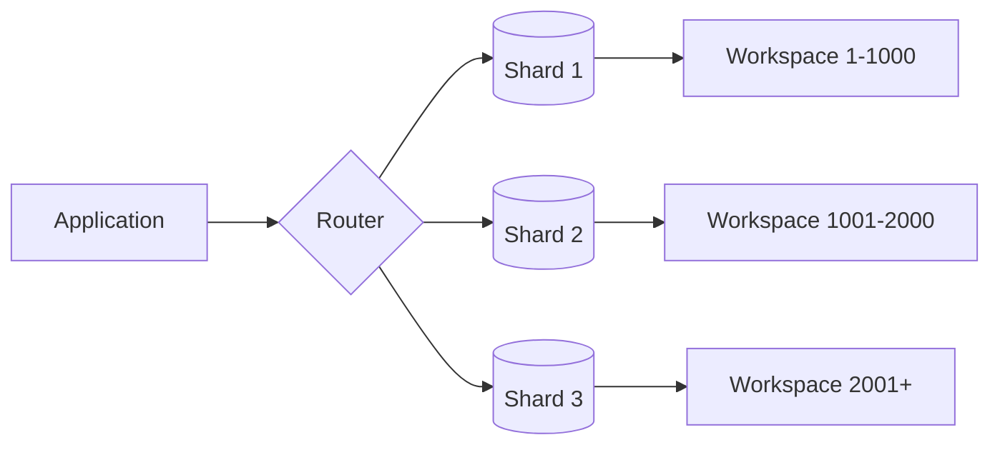

## 5.3 API Design

### 5.3.1 REST Endpoints

| Endpoint | Method | Purpose | Request Format |
|----------|---------|---------|----------------|
| /api/v1/tasks | GET | List tasks | Query params |
| /api/v1/tasks | POST | Create task | JSON body |
| /api/v1/tasks/{id} | PUT | Update task | JSON body |
| /api/v1/projects | GET | List projects | Query params |
| /api/v1/analytics | GET | Get analytics | Query params |

### 5.3.2 WebSocket Events

```mermaid
sequenceDiagram
    participant Client
    participant Gateway
    participant Service
    participant Database

    Client->>Gateway: Connect (JWT)
    Gateway->>Service: Authenticate
    Service->>Client: Connection ACK
    
    Client->>Gateway: Subscribe (project_id)
    Gateway->>Service: Register subscription
    
    Service->>Database: Watch changes
    Database-->>Service: Change event
    Service-->>Client: Update notification
```

### 5.3.3 Integration Patterns

```mermaid
graph TD
    A[Client Apps] --> B{API Gateway}
    B --> C[Auth Service]
    B --> D[Task Service]
    B --> E[Analytics Service]
    
    D --> F[(Primary DB)]
    D --> G[Message Queue]
    
    G --> H[Notification Service]
    G --> I[Search Indexer]
    G --> J[Analytics Processor]
```

### 5.3.4 Response Formats

| Response Type | Format | Example |
|--------------|--------|---------|
| Success | `{"status": "success", "data": {...}}` | Task details |
| Error | `{"status": "error", "message": "..."}` | Validation error |
| List | `{"status": "success", "data": [], "meta": {...}}` | Paginated results |
| Stream | Server-Sent Events | Real-time updates |

# 6. USER INTERFACE DESIGN

## 6.1 Design System Key

```
ICONS:                UI COMPONENTS:           CONTAINERS:
[?] Help              [ ] Checkbox            +------------------+
[$] Payment           ( ) Radio               |     Box         |
[i] Info             [...] Text Input         +------------------+
[+] Add              [v] Dropdown
[x] Close            [====] Progress          NAVIGATION:
[<] Previous         [Button] Button          --> Flow Direction
[>] Next                                      <-- Back Flow
[^] Upload           STATES:
[#] Dashboard        * Required Field         HIERARCHY:
[@] Profile          ! Validation Error       +-- Parent
[=] Settings         ~ Loading                |   +-- Child
[*] Favorite         # Selected
```

## 6.2 Main Dashboard

```
+------------------------------------------------------------------------------+
|  TaskStream AI                                [@] Profile    [?] Help  [=]    |
+------------------------------------------------------------------------------+
|  [#] Dashboard | Projects | Analytics | Teams                   [!] Alerts    |
+------------------------------------------------------------------------------+
|                                                                              |
|  +-- Active Projects ------------------+  +-- Recent Tasks ----------------+ |
|  |                                    |  |                                 | |
|  |  [v] Filter Projects              |  |  [ ] Update API documentation   | |
|  |                                    |  |  [ ] Review ML model accuracy   | |
|  |  Project Alpha  [====] 75%         |  |  [x] Deploy v2.1 to staging    | |
|  |  Project Beta   [===] 45%          |  |                                 | |
|  |  Project Gamma  [======] 90%       |  |  [+] Add New Task              | |
|  |                                    |  |                                 | |
|  +------------------------------------+  +---------------------------------+ |
|                                                                              |
|  +-- Team Activity -------------------+  +-- Analytics Summary -----------+ |
|  |                                    |  |                                 | |
|  |  [@] Alice: Updated ML pipeline    |  |  Resource Utilization: 85%     | |
|  |  [@] Bob: Completed code review    |  |  Sprint Progress:   [====] 80% | |
|  |  [@] Carol: Added new test cases   |  |  Tasks Completed:   24/30      | |
|  |                                    |  |                                 | |
|  +------------------------------------+  +---------------------------------+ |
|                                                                              |
+------------------------------------------------------------------------------+
```

## 6.3 Task Creation Modal

```
+------------------------------------------+
|  Create New Task                    [x]  |
+------------------------------------------+
|                                          |
|  Title: *                               |
|  [..............................]        |
|                                          |
|  Description:                           |
|  [..............................]        |
|  [..............................]        |
|                                          |
|  Assignee:                              |
|  [v] Select Team Member                 |
|                                          |
|  Due Date: *                            |
|  [...] MM/DD/YYYY                       |
|                                          |
|  Priority:                              |
|  ( ) High                               |
|  (*) Medium                             |
|  ( ) Low                                |
|                                          |
|  Tags:                                  |
|  [...] Add tags                         |
|                                          |
|  [Cancel]         [Create Task]         |
|                                          |
+------------------------------------------+
```

## 6.4 Analytics Dashboard

```
+------------------------------------------------------------------------------+
|  Analytics                                                    [^] Export      |
+------------------------------------------------------------------------------+
|  Time Range: [v] Last 30 Days                        [Refresh] [Filter]      |
+------------------------------------------------------------------------------+
|                                                                              |
|  +-- Resource Metrics ----------------+  +-- Task Distribution -----------+ |
|  |                                    |  |                                 | |
|  |  Team Capacity     [========] 90%  |  |  High Priority    [===] 30%    | |
|  |  Sprint Velocity   [======] 75%    |  |  Medium Priority  [====] 40%   | |
|  |  Burndown Rate     [=====] 65%     |  |  Low Priority     [===] 30%    | |
|  |                                    |  |                                 | |
|  +------------------------------------+  +---------------------------------+ |
|                                                                              |
|  +-- Predictive Insights ------------+  +-- Team Performance ------------+ |
|  |                                    |  |                                 | |
|  |  [!] Potential Bottleneck:        |  |  Top Performers:                | |
|  |  API Integration (Next Week)       |  |  1. [@] Alice    [====] 95%    | |
|  |                                    |  |  2. [@] Bob      [===] 85%     | |
|  |  [i] Suggested Actions:           |  |  3. [@] Carol    [===] 82%     | |
|  |  - Add backend resource           |  |                                 | |
|  |  - Adjust sprint capacity         |  |  [v] View All Members           | |
|  |                                    |  |                                 | |
|  +------------------------------------+  +---------------------------------+ |
|                                                                              |
+------------------------------------------------------------------------------+
```

## 6.5 Project Board View

```
+------------------------------------------------------------------------------+
|  Project: Alpha                                          [+] Add Task  [=]    |
+------------------------------------------------------------------------------+
|                                                                              |
|  +-- Backlog -------+  +-- In Progress --+  +-- Review ------+  +-- Done --+ |
|  |                  |  |                 |  |               |  |           | |
|  | [*] API Design   |  | ML Pipeline     |  | UI Updates    |  | Database  | |
|  | [...........]    |  | [=========] 90% |  | [====] 40%    |  | [x] Done  | |
|  | [@] Alice        |  | [@] Bob         |  | [@] Carol     |  | [@] Dave  | |
|  |                  |  |                 |  |               |  |           | |
|  | [+] Test Cases   |  | Documentation   |  |               |  |           | |
|  | [...........]    |  | [====] 45%      |  |               |  |           | |
|  | [@] Eve          |  | [@] Frank       |  |               |  |           | |
|  |                  |  |                 |  |               |  |           | |
|  | [+] Add Card     |  | [+] Add Card    |  | [+] Add Card  |  |           | |
|  +------------------+  +-----------------+  +---------------+  +-----------+ |
|                                                                              |
|  [<] Previous Sprint                                          [>] Next Sprint|
+------------------------------------------------------------------------------+
```

## 6.6 Responsive Design Breakpoints

| Breakpoint | Width | Layout Adjustments |
|------------|-------|-------------------|
| Mobile | 320px - 767px | Single column, stacked components |
| Tablet | 768px - 1023px | Two column layout, condensed metrics |
| Desktop | 1024px - 1439px | Full layout with all components |
| Wide | 1440px+ | Extended layout with additional data |

## 6.7 Component States

| State | Visual Indicator | Example |
|-------|-----------------|---------|
| Loading | ~ | ~Loading Data~ |
| Error | ! | !Invalid Input! |
| Success | ✓ | ✓Task Created |
| Warning | ! | !Approaching Deadline! |
| Selected | # | #Current Project# |
| Disabled | _ | _Inactive Option_ |

# 7. SECURITY CONSIDERATIONS

## 7.1 Authentication and Authorization

### 7.1.1 Authentication Flow

```mermaid
sequenceDiagram
    participant U as User
    participant F as Frontend
    participant A as Auth Service
    participant I as Identity Provider
    participant S as System Services

    U->>F: Access Request
    F->>A: Forward Request
    A->>I: OAuth2 Flow
    I->>U: Authentication Prompt
    U->>I: Credentials
    I->>A: Identity Token
    A->>F: JWT + Refresh Token
    F->>S: Request + JWT
    S->>S: Validate Token
    S->>F: Response
```

### 7.1.2 Authorization Matrix

| Role | Task Management | User Management | Analytics | System Config | Integration Management |
|------|----------------|-----------------|-----------|---------------|----------------------|
| Admin | Full Access | Full Access | Full Access | Full Access | Full Access |
| Project Manager | Full Access | View Only | Full Access | No Access | View Only |
| Team Lead | Team Scope | No Access | Team Scope | No Access | No Access |
| Developer | Self Scope | No Access | Self Scope | No Access | No Access |
| Viewer | View Only | No Access | View Only | No Access | No Access |

## 7.2 Data Security

### 7.2.1 Encryption Standards

| Data State | Method | Key Management |
|------------|--------|----------------|
| In Transit | TLS 1.3 | Automatic rotation (90 days) |
| At Rest | AES-256-GCM | AWS KMS with CMK |
| In Memory | Secure memory handling | Runtime encryption |
| Backups | AES-256-CBC | Offline key storage |

### 7.2.2 Data Classification

```mermaid
graph TD
    A[Data Input] --> B{Classification Engine}
    B --> C[Public]
    B --> D[Internal]
    B --> E[Confidential]
    B --> F[Restricted]
    
    C --> G[No Encryption]
    D --> H[Standard Encryption]
    E --> I[Enhanced Encryption]
    F --> J[Maximum Security]
    
    G --> K[Public Storage]
    H --> L[Standard Storage]
    I --> M[Secure Storage]
    J --> N[Isolated Storage]
```

## 7.3 Security Protocols

### 7.3.1 Access Control

| Control Type | Implementation | Monitoring |
|--------------|----------------|------------|
| Network | AWS Security Groups | Real-time alerts |
| Application | RBAC + ABAC | Audit logging |
| Database | Row-level security | Query monitoring |
| API | OAuth 2.0 + API Keys | Rate limiting |

### 7.3.2 Security Monitoring

```mermaid
graph LR
    A[Security Events] --> B{SIEM}
    B --> C[Threat Detection]
    B --> D[Compliance Monitoring]
    B --> E[Access Monitoring]
    
    C --> F[Alert System]
    D --> F
    E --> F
    
    F --> G[Security Team]
    F --> H[Automated Response]
    
    G --> I[Incident Management]
    H --> I
```

### 7.3.3 Compliance Requirements

| Standard | Requirements | Implementation |
|----------|--------------|----------------|
| SOC 2 Type II | Access Controls | RBAC + MFA |
| GDPR | Data Privacy | Encryption + Data Classification |
| CCPA | User Rights | Self-service Portal |
| ISO 27001 | Security Management | Security Framework Implementation |

### 7.3.4 Security Testing

| Test Type | Frequency | Tools |
|-----------|-----------|-------|
| Penetration Testing | Quarterly | Burp Suite, Metasploit |
| Vulnerability Scanning | Weekly | Nessus, OWASP ZAP |
| Code Security Analysis | Per Commit | SonarQube, Snyk |
| Dependency Scanning | Daily | Dependabot, OWASP Dependency-Check |

### 7.3.5 Incident Response

```mermaid
stateDiagram-v2
    [*] --> Detection
    Detection --> Analysis
    Analysis --> Containment
    Containment --> Eradication
    Eradication --> Recovery
    Recovery --> PostIncident
    PostIncident --> [*]
    
    Analysis --> Escalation
    Escalation --> Containment
```

### 7.3.6 Security Maintenance

| Activity | Frequency | Responsibility |
|----------|-----------|----------------|
| Security Patches | Monthly | DevOps Team |
| Certificate Rotation | 90 Days | Security Team |
| Access Review | Quarterly | Security + HR |
| Security Training | Semi-annual | All Staff |
| Policy Review | Annual | Security Team |

# 8. INFRASTRUCTURE

## 8.1 Deployment Environment

TaskStream AI utilizes a cloud-native architecture with multi-region deployment for high availability and global scalability.

| Environment | Purpose | Infrastructure |
|-------------|---------|----------------|
| Production | Live system serving end users | Multi-region AWS deployment |
| Staging | Pre-production testing | Single region AWS deployment |
| Development | Development and testing | Containerized local/cloud hybrid |
| DR | Disaster recovery | Cross-region AWS failover |

```mermaid
graph TB
    subgraph "Global Infrastructure"
        A[Global Route 53] --> B{CloudFront CDN}
        B --> C[US-East Region]
        B --> D[EU-West Region]
        B --> E[AP-Southeast Region]
        
        subgraph "Regional Setup"
            C --> F[Primary Zone]
            C --> G[Secondary Zone]
            F --> H[(Data Store)]
            G --> H
        end
    end
```

## 8.2 Cloud Services

| Service | Purpose | Configuration |
|---------|---------|--------------|
| AWS EKS | Container orchestration | Multi-AZ deployment |
| AWS RDS | PostgreSQL database | Multi-AZ with read replicas |
| AWS ElastiCache | Redis caching | Cluster mode enabled |
| AWS DocumentDB | MongoDB compatible | Sharded cluster |
| AWS OpenSearch | Search and analytics | Multi-node deployment |
| AWS S3 | Object storage | Cross-region replication |
| AWS CloudFront | Global CDN | Edge location optimization |
| AWS Route 53 | DNS management | Latency-based routing |

## 8.3 Containerization

```mermaid
graph TD
    subgraph "Container Architecture"
        A[Base Images] --> B{Custom Images}
        B --> C[Frontend Container]
        B --> D[Backend Services]
        B --> E[Worker Processes]
        
        C --> F[Nginx]
        D --> G[Application Code]
        E --> H[Processing Jobs]
        
        I[Container Registry] --> J[Image Distribution]
        J --> K[EKS Clusters]
    end
```

| Component | Base Image | Size Limit | Security Scanning |
|-----------|------------|------------|------------------|
| Frontend | nginx:alpine | 250MB | Trivy, Snyk |
| Backend | python:3.11-slim | 500MB | Trivy, Snyk |
| Workers | python:3.11-slim | 500MB | Trivy, Snyk |
| Cache | redis:alpine | 100MB | Trivy, Snyk |

## 8.4 Orchestration

```mermaid
graph TB
    subgraph "Kubernetes Architecture"
        A[EKS Control Plane] --> B{Node Groups}
        B --> C[Application Nodes]
        B --> D[Processing Nodes]
        B --> E[System Nodes]
        
        C --> F[Frontend Pods]
        C --> G[Backend Pods]
        D --> H[Worker Pods]
        E --> I[Monitoring Pods]
    end
```

| Component | Scaling Policy | Resource Limits | Availability |
|-----------|---------------|-----------------|--------------|
| Frontend | HPA (CPU 70%) | 2 CPU, 4GB RAM | Min 3 replicas |
| Backend | HPA (CPU 70%) | 4 CPU, 8GB RAM | Min 5 replicas |
| Workers | KEDA (Queue length) | 2 CPU, 4GB RAM | Auto-scaled |
| System | Static | 1 CPU, 2GB RAM | 1 per node |

## 8.5 CI/CD Pipeline

```mermaid
graph LR
    A[Code Push] --> B{GitHub Actions}
    B --> C[Build]
    C --> D[Test]
    D --> E[Security Scan]
    E --> F{Quality Gate}
    F --> |Pass| G[Deploy Staging]
    G --> H[Integration Tests]
    H --> I{Approval}
    I --> |Approved| J[Deploy Production]
    F --> |Fail| K[Notify Team]
    I --> |Rejected| K
```

| Stage | Tools | SLA | Automation |
|-------|-------|-----|------------|
| Build | GitHub Actions | < 10 min | Full |
| Test | Jest, Pytest | < 15 min | Full |
| Security | Snyk, SonarQube | < 10 min | Full |
| Deploy Staging | ArgoCD | < 15 min | Full |
| Integration Tests | Cypress, Postman | < 30 min | Full |
| Deploy Production | ArgoCD | < 30 min | Semi-automated |

### Infrastructure as Code

| Component | Tool | Purpose |
|-----------|------|---------|
| Infrastructure | Terraform | Cloud resource provisioning |
| Configuration | Ansible | System configuration |
| Secrets | AWS Secrets Manager | Secrets management |
| Monitoring | Prometheus/Grafana | Infrastructure monitoring |

# 8. APPENDICES

## 8.1 Additional Technical Information

### Development Environment Setup

```mermaid
graph TD
    A[Local Development] --> B{Development Tools}
    B --> C[VS Code + Extensions]
    B --> D[PyCharm Professional]
    B --> E[Docker Desktop]
    
    F[Version Control] --> G{Git Flow}
    G --> H[Feature Branches]
    G --> I[Development]
    G --> J[Staging]
    G --> K[Main]
    
    L[Local Testing] --> M{Test Suites}
    M --> N[Unit Tests]
    M --> O[Integration Tests]
    M --> P[E2E Tests]
```

### Code Quality Standards

| Category | Tool | Configuration |
|----------|------|--------------|
| Python Linting | flake8 | Max line length: 88 |
| TypeScript Linting | ESLint | Airbnb preset |
| Code Formatting | Black/Prettier | Auto-format on save |
| Test Coverage | Jest/Pytest | Minimum 80% coverage |
| Static Analysis | SonarQube | Quality gate: 85% |

## 8.2 GLOSSARY

| Term | Definition |
|------|------------|
| Artifact Repository | Centralized storage for build outputs and dependencies |
| Blue-Green Deployment | Deployment strategy using two identical environments for zero downtime |
| Circuit Breaker | Design pattern that prevents cascading failures in distributed systems |
| Event Sourcing | Pattern of storing state changes as a sequence of events |
| Feature Flag | Configuration that enables/disables functionality without code deployment |
| Idempotency | Property where an operation produces the same result regardless of repetition |
| Service Mesh | Infrastructure layer that handles service-to-service communication |
| Tenant | Isolated instance of the application for a specific organization |

## 8.3 ACRONYMS

| Acronym | Full Form |
|---------|------------|
| ABAC | Attribute-Based Access Control |
| CDN | Content Delivery Network |
| CQRS | Command Query Responsibility Segregation |
| DDD | Domain-Driven Design |
| ELK | Elasticsearch, Logstash, Kibana |
| gRPC | Google Remote Procedure Call |
| IOPS | Input/Output Operations Per Second |
| JWT | JSON Web Token |
| K8s | Kubernetes |
| MTBF | Mean Time Between Failures |
| MTTR | Mean Time To Recovery |
| NLP | Natural Language Processing |
| OIDC | OpenID Connect |
| RBAC | Role-Based Access Control |
| RTO | Recovery Time Objective |
| SLA | Service Level Agreement |
| SLO | Service Level Objective |
| SOA | Service-Oriented Architecture |
| SSO | Single Sign-On |
| TLS | Transport Layer Security |
| WAF | Web Application Firewall |
| YAML | YAML Ain't Markup Language |